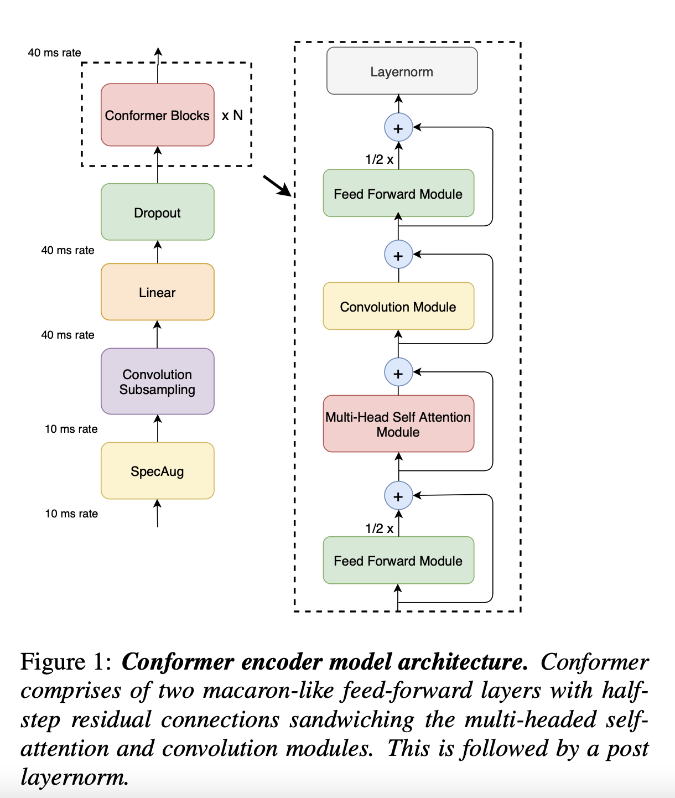
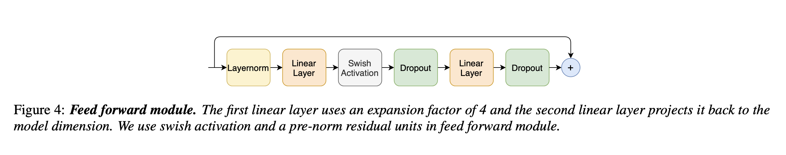
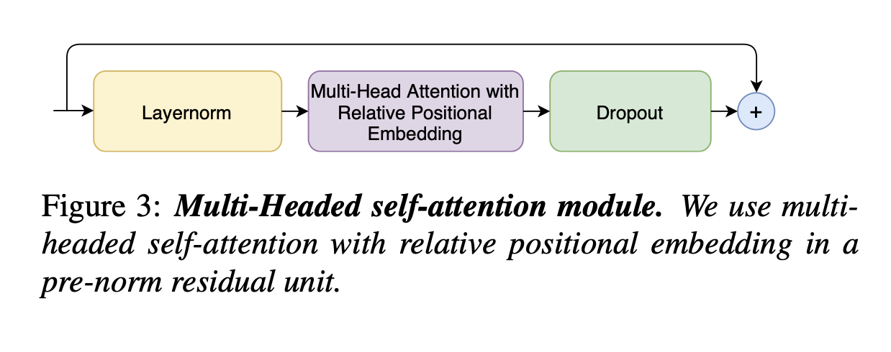
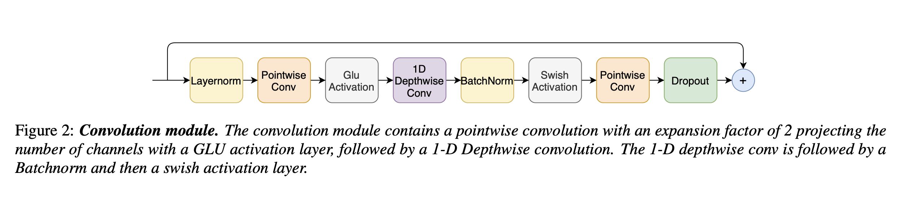

# Conformer Model Implementation in Kaldi

## Kaldi-conformer

Wenqing Yang (wy2374@columbia.edu)

### Overview

**This project (Conformer) is fully implemented by C++ in Kaldi.**

This project presents an implementation of the Conformer model, a state-of-the-art speech recognition architecture, using the Kaldi speech recognition toolkit. The Conformer model combines convolutional neural networks with self-attention mechanisms to achieve superior performance in automatic speech recognition tasks. Currently, the Conformer model stands at the forefront of End-to-End Automatic Speech Recognition (E2E ASR) technology. It's acclaimed for its state-of-the-art architecture, which innovatively merges various modules, delivering outstanding performance in benchmarks. So far, the implementation of the Conformer model has predominantly been in PyTorch, a popular machine learning framework. In contrast, Kaldi as another highly efficient toolkit for speech recognition, offers a different approach. Known for its robustness and versatility in speech recognition tasks, Kaldi has not yet been utilized to implement the Conformer model. This presents a unique opportunity to explore the integration of this advanced model into the Kaldi toolkit. This project aims to bridge this gap by detailing the integration of the Conformer model within the Kaldi framework.

### Features



Implementation of Conformer blocks with multi-head self-attention and convolution modules.

Efficient convolutional subsampling for input data processing.

Integration with Kaldi's robust speech processing and GPU-accelerated computation capabilities.

- Convolutional Subsampling:

Convolutional subsampling is a critical part of the Conformer model, reducing the temporal resolution of the input while increasing the feature dimension. In Kaldi, this was achieved through a custom Conv2dSubsampling component. This component consists of two consecutive convolutional layers, each followed by ReLU activation. The layers employ a kernel size of 3 and a stride of 2, effectively reducing the input sequence length by a factor of 4. The subsampling layer outputs a transformed feature matrix ready for subsequent processing by the Conformer blocks.

- Conformer Blocks:

The core of the Conformer model is its blocks, each comprising various specialized components that collectively enhance its ability to process sequential data effectively. In our Kaldi implementation, each Conformer block is meticulously engineered to include:

**a). Feed Forward Module:**



Processes the output from the self-attention mechanism, consisting of two linear layers with a nonlinear activation function in between. Optimized in Kaldi for large-scale matrix operations. The expansion factor increases the dimensionality of the intermediate representation, capturing more complex features.

**b). Multi-Head Self Attention Module:** 



Captures contextual relationships within input sequences. Parallelizes the attention mechanism across multiple heads, each computing scaled dot-product attention. Their outputs are concatenated and linearly transformed. Optimized for efficiency, leveraging CUDA for large-scale data.

**c).Convolution Module:**



Captures local features within the input sequence. Consists of a depthwise separable convolution layer, followed by batch normalization and Swish activation. This structure is computationally efficient and effective for time-series data processing.
These components work together within each Conformer block, contributing to the model's ability to process and understand complex speech patterns effectively.

- Activations and Utils:

a). Utility functions and classes play a vital role in our implementation:

b). Custom Activation Functions: Includes Swish and Gated Linear Unit (GLU), implemented as standalone components in Kaldi.
Weight Initialization and Normalization Functions: Crafted to ensure that the model adheres to the expected behavior of Conformer.


### Structure

conformer % tree
.
├── CMakeLists.txt
├── Makefile    
├── conformer-activation.cc
├── conformer-activation.h
├── conformer-attention.cc
├── conformer-attention.h
├── conformer-convolution.cc
├── conformer-convolution.h
├── conformer-embedding.cc
├── conformer-embedding.h
├── conformer-encoder.cc
├── conformer-encoder.h
├── conformer-feedforward.cc
├── conformer-feedforward.h
├── conformer-models.cc
├── conformer-models.h
├── conformer-utils.cc
├── conformer-utils.h
├── gen_cmakelist.py
├── main.cc
└── main.h

21 files, all are implemented by C++ in Kaldi.

### Content of each source and head files:
**Makefile, CMakeList, gen_cmakelist**

a). Makefile -- compiling a set of C++ source files into object files, then linking these object files with additional Kaldi libraries to create a library named kaldi-conformer. It leverages configurations and rules defined in Kaldi's own Makefiles (kaldi.mk and default_rules.mk) to ensure consistent build processes with the rest of the Kaldi project. 

b). CMakeList.txt -- aligned with the dependencies format under kaldi/src/.

c). gen_cmakelist.py -- used to generate CMakeList.txt accroding to Makefile

**conformer-activations:**

a). Swish -- activations implemented by C++ and Kaldi

b). GLU -- activations implemented by C++ and Kaldi

**conformer-attention:**

a). RelativeMultiHeadAttentionComponent -- implemented by C++ and Kaldi to align with attention in PyTorch, allowing the model to focus on different parts of the input sequence and understand the relative positions of sequence elements (similar to the part of Transformer) 

b). MultiHeadAttentionModule -- combining `RelativeMultiHeadAttentionComponent` with LayerNorm and Dropout layer of the attention module 

**conformer-convolution:**

a). Conv1d -- implemented by C++ and Kaldi to align with nn.conv1d() in PyTorch

b). Conv2d -- implemented by C++ and Kaldi to align with nn.conv2d() in PyTorch

c). DepthwiseConv1d

d). PointwiseConv1d

e). ConformerConvModule -- combining `DepthwiseConv1d`, `PointwiseConv1d`, Swish, GLU, BatchNorm1d, LayerNorm, Dropout to form convolution module in Conformer

f). Conv2dSubampling -- combining 2 conv2d layers and 2 ReLU

**conformer-embedding:**

a). PositionalEncoding --  Kaldi/C++ version to inject information about the relative or absolute position of tokens in the sequence. 

**conformer-encoder:**

a). ConformerBlock -- intergrating convolution module (above), attention module (above), feed forward module (below)

b). ConformerEncoder -- intergrating all the parts in Figure 1.

**conformer-feedforward:**

a). FeedForwardModule -- implemented by Kaldi/C++, combining LayerNorm, Swish, Linear layer, Dropout together of Conformer FeedForward Layer

**conformer-models:**

a). Completed Conformer model

**conformer-utils:**

- implemented by C++ and Kaldi to align with utils function in PyTorch

a). LayerNorm
b). BatchNorm1d
c). Dropout
d). ReLU
e). Linear
f). CalculateOutputLength
g). ApplyMask
h). AddBias
i). AddMatrices

### Requirements

Kaldi Speech Recognition Toolkit 

C++ Compiler (e.g., g++)

CUDA Toolkit (for GPU acceleration, optional)

Additional dependencies listed in Makefile/CMakeList.txt (aligned with Kaldi/src/.)

### Installation

Clone Kaldi repository:

```
git clone https://github.com/kaldi-asr/kaldi.git
cd kaldi
git remote add upstream https://github.com/kaldi-asr/kaldi.git
```

Build Kaldi repository:

```
cd tools
make
extras/check_dependencies.sh

cd ..
./configure
make depend
make
```

Clone kaldi-conformer repository:
```
git clone https://github.com/Merlin0513/Kaldi-conformer.git
cd Kaldi-conformer
```

### Usage

Run the compiled Conformer model:

```
./main_program
```

### Example (Pending)
Training part (backward) is pending.

*Input:*

- Input to Kaldi is usually 2D matrix (T, F), T shows time frames, and F shows number of features.

- I obtained 1000 frames after feature extracion, each with 13 Mel-frequency cepstral coefficients (MFCCs). The resulting input matrix to Kaldi would have the dimensions of 1000 x 13.

- Dimensions: The matrix is 1000 rows tall and 13 columns wide. Each row represents one frame of audio, and each column represents one of the 13 MFCC features for that frame.

- | MFCC1 | MFCC2 | MFCC3 | MFCC4 | MFCC5 | MFCC6| MFCC7 | MFCC8 | MFCC9 | MFCC10 | MFCC11 | MFCC12 | MFCC13 |
|:--------:|:--------:|---------:|---------:|---------:|---------:|---------:|---------:|---------:|---------:|---------:|---------:|---------:|
|-0.35334487 | -0.95165449 |  0.44435054 |  0.86474822 |  0.9644576 |  0.69874035 |  0.16265555 |  0.29633604 |  0.50446081 |  0.19784188 | -0.50917848 |  0.16372119 |  0.08428841 |
| Row 2, Col 1 | Row 2, Col 2 | Row 2, Col 3 |
| Row 3, Col 1 | Row 3, Col 2 | Row 3, Col 3 |

- [[-0.35334487, -0.95165449,  0.44435054,  0.86474822,  0.9644576 ,  0.69874035,  0.16265555,  0.29633604,  0.50446081,  0.19784188, -0.50917848,  0.16372119,  0.08428841],
 [ 1.2538247 , -0.69291813, -1.43273087,  0.60407718, -0.76455384,  0.72688382, -0.39197256, -0.22359876, -1.22606798,  0.92249466, -0.60008128,  0.44253412, -0.02842545],
 [ 0.65987204,  1.34957948,  0.06847772, -0.65588176, -0.16863621,  1.45114111,  1.40846882, -1.63435145,  1.19978887, -0.92174252,  0.84968286, -1.24177759, -2.26446818],
 [-0.93523281,  1.49038584, -0.73518638, -1.51611687,  1.45539284,  1.49358285,  1.00039057, -0.43222398, -0.2829213 , -0.5081075 ,  1.73101063,  0.65469499, -0.00000612],
 [ 0.30782431,  0.03984987,  0.38212052,  1.32942278, -0.76100636,  1.63661281,  0.80487306,  0.96602741, -0.20541635, -0.9833435 , -2.09880019,  1.01005629,  0.7254073 ]]
...

*Output:*

- The output matrix from the simulated Conformer model has been generated. Given the input matrix of dimensions [1000 x 13] and assuming num_classes = 20, the output matrix has dimensions [1000 x 20]. Each row in the output matrix corresponds to one frame of the input audio, and each column represents the model's output (softmax probability) for one of the 20 classes. 

[[ 1.96429584,  2.95293745, 0.006278,  4.816209, 5.1075, 2.18769, 3.47850, 4.58930, 1.279494, 5.272904, 8.8393027, 3.2729048, 5.0298734, 6.9583798, 0.223930846, 5.573920, 7.3683993, 2.920836, 3.009186, 2.00273544],
...
